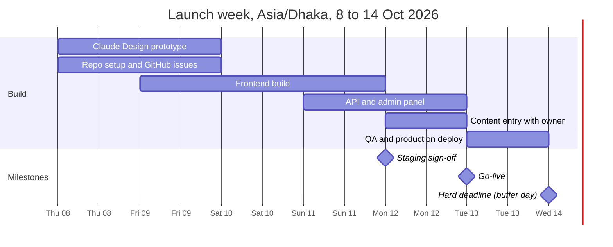
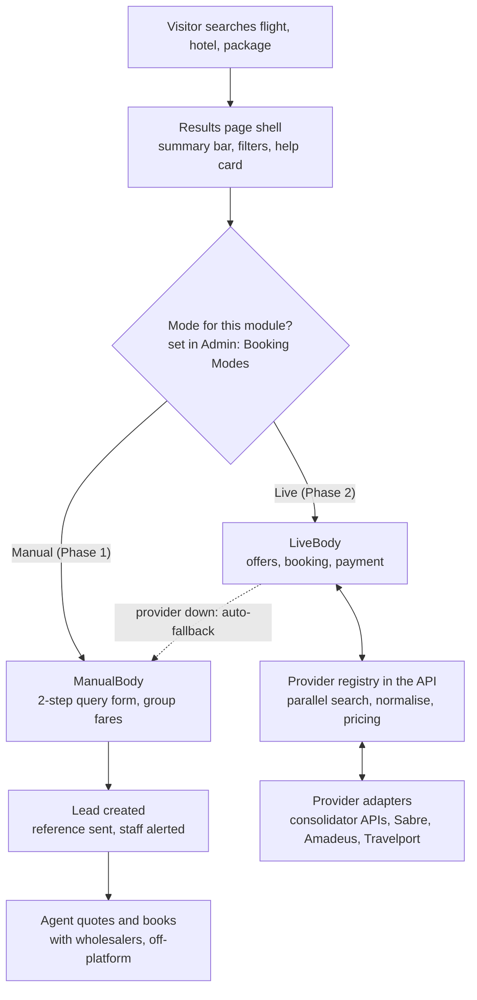

# Waafa OTA Platform — Product Requirements Document

Oct 8, 2026 · @Mahedi Hasan Emon

## 1. Document control and executive summary

Waafa goes live on Oct 13, 2026 with one mobile-first website for two licensed brands, a hybrid OTA that captures travel leads today and flips to live GDS/API booking later without a rebuild.

| Item | Value |
| --- | --- |
| Product | Waafa OTA Platform: public website + admin panel + API |
| Version | 1.0, build baseline |
| Developer | Mahedi Hasan Emon |
| Client brands | Waafa Tours and Travel; Waafa International |
| Repository | [mahedi-emon/Waafa-OTA-Platform](https://github.com/mahedi-emon/Waafa-OTA-Platform), GitHub Project "Waafa OTA Platform" (#4) |
| Go-live target | Oct 13, 2026; hard deadline: before Oct 14, 2026 |
| Build flow | Claude Design prototype, then Claude Code builds frontend, backend, admin |
| Stack | Next.js + Tailwind CSS + shadcn/ui + Motion; Node.js (NestJS on Fastify); PostgreSQL + Prisma; Redis |

**What we are building.** Travel (flights, hotels, tour packages, visa) runs under Waafa Tours and Travel. Waafas World, an online store for any product category (printer and office supplies first), runs under Waafa International together with its printing solutions and international trading services. Manpower and recruitment is excluded until it is licensed.

**How it works at launch.** Every flight, hotel and package search ends in a short query form. Each submission lands in the admin panel as a lead; staff quote and book off-platform with consolidators.

**How it grows.** A per-module Golden Switch in admin settings moves Flights, Hotels and Packages from Manual mode to Live mode once IATA, a consolidator API or a GDS is in place. The UI layout does not change; only the provider behind it does.

**Launch scope.** About 60% of the full platform ships by the deadline: every public page, lead capture for all travel modules, the Waafas World store with cash-on-delivery and offline payment, and admin for leads, content and orders. Online payment, customer accounts and Bangla follow in Phase 1B; live booking in Phase 2.

**Reading this PRD.** Requirements carry IDs (FR-AREA-nn) and a priority: P0 ships at launch, P1 within 30 days after, P2 with live booking (Phase 2), P3 later.

## 2. Business context and compliance boundaries

Two licensed businesses share one website, and every feature sits under the brand whose trade licence covers it.

| Brand | Licensed activity (scoping only) | Where it lives on the site |
| --- | --- | --- |
| Waafa Tours and Travel | Tours and travels agency, air ticketing, visa processing | Flights, Hotels, Tour Packages, Visa Services, Visa Guide, Baggage Information, EMI, Offline Payment |
| Waafa International (est. 2010) | Importer, exporter, supplier (non-chemical) | Waafas World: online store for any product category (printer and office supplies first), Printing Solutions, International Business and Trading |
| Manpower and Recruitment | Not licensed yet | Nowhere in this build (no nav item, page, footer link, SEO text or copy); planned as Phase F after the licence |

**Brand identity.** WAAFA stands for "Worldwide Alliance for Advancement, Future & Achievement". The company tagline is "Connecting the World, Creating the Future." Core values: Trust, Quality, Innovation, Excellence, Integrity, Global Vision.

**Logo.** A ribbon-style W in deep navy to electric blue with a cyan highlight and silver edges. The WAAFA wordmark uses crossbar-less A shapes with small gold triangles inside; INTERNATIONAL sits below in serif capitals.

**Company story (About Us).** Founded in 2010, Waafa International spent nearly 16 years serving corporate printing and toner needs. In 2026 it expands into travel, international trading and technology services.

**Public contact details** (from the Facebook page; all editable in admin, never hard-coded):

- Address: 193/C-1, 4th Floor, East Side, Motijheel Plaza, Aziz Square, Box Kalvat Road, PS Motijheel, Dhaka, Bangladesh
- Phone and WhatsApp: 01823-232241
- Email: info@waafasworld.com
- Office hours: Saturday to Thursday, 10:00 am to 6:00 pm (Asia/Dhaka); closed on Friday. The site shows a live "Open now" or "Closed" chip from these hours.
- Facebook: [facebook.com/waafatoursandtravel](https://www.facebook.com/waafatoursandtravel)

**Compliance rules (non-negotiable).**

1. Trade licence data (licence numbers, owner details, ID numbers, fees) never appears on the site, in seed data or in the repository.
2. No Hajj or Umrah products in this build. They need a separate Hajj/Umrah agency licence; the module is planned as Phase F once that licence exists, with no route, menu item, copy, seed data or image until then.
3. No manpower, recruitment or employment-visa processing in this build; it is planned as Phase F once its licence is issued. Visa services cover tourist, business, student, medical and transit visas only.
4. Fares shown before live booking are labelled indicative (group fares, "from" prices). The site never fakes live availability.
5. Passport and visa documents are personal data: private storage, role-restricted access, scheduled deletion.
6. Waafas World lists only goods the Waafa International trade licence covers and never restricted items such as medicines, chemicals, weapons or drugs; it follows Bangladesh's digital commerce rules on pricing, delivery and refunds.

**Reference inputs.** Two vendor proposals for another agency (Nano IT World, Laravel; Softopark, MERN) serve as feature checklists. Their combined feature sets are merged into this PRD, minus Umrah and anything off-licence.

## 3. Goals, success metrics and deadline

Launch succeeds if the site is live before 14 October 2026 and every search becomes either a logged demand signal or a contactable lead answered within 30 minutes.

**Goals**

1. Ship the P0 scope on a production domain by 13 October 2026, with 14 October as buffer only.
2. Capture demand: log every search, turn every query into a lead with phone and travel details.
3. Earn trust at first glance: a design that matches or beats GoZayaan and ShareTrip, fast on mid-range Android phones.
4. Sell online from day one through Waafas World, starting with printer and office supplies and open to any product category, with cash on delivery and offline payment.
5. Never rebuild: GDS, consolidator and payment providers plug in behind the Golden Switch.

**Success metrics** (proposed; owner reviews after 30 days)

| Metric | Target | Measured by |
| --- | --- | --- |
| First response to a new lead | Median 30 min or less in business hours | Lead created vs first status change |
| Lead completeness | 100% of leads carry phone and travel details | Form validation, admin report |
| Search-to-lead conversion | Baseline in first 30 days, then a target | Search logs vs leads |
| Core Web Vitals, mobile p75 | LCP 2.5 s or less, INP 200 ms or less, CLS 0.1 or less | Vercel Analytics, Search Console |
| Lighthouse, mobile | Performance 90+, Accessibility 95+, SEO 95+ | CI Lighthouse run on key pages |
| Spam leads | Under 5% | Leads marked spam |
| Uptime | 99.5% monthly | Uptime monitor |
| Phase 2 switch cost | Zero layout changes to go Live | Phase 2 release review |

**Not in the launch scope:** live fares and ticketing, online payment for travel, B2B agent portal, mobile apps, Bangla language (P1); manpower, Hajj and Umrah (Phase F, after the licence).

## 4. Users, personas and staff roles

Most visitors arrive on a phone from Facebook or Google, want a human to confirm the fare, and judge trust in the first five seconds.

| Persona | Context | What they need | Main flows |
| --- | --- | --- | --- |
| First-time international traveller | Mid-range Android, mobile data, Bangla-first, WhatsApp user | Simple search, plain words, a person to call | Flight query, visa query, WhatsApp chat |
| Family or group organiser | Plans trips for 4 to 10 people | Packages, group fares, pay in instalments | Package detail to query, EMI page |
| Corporate travel and office manager | Office desktop, books staff travel, also buys office supplies | Fast quotes, invoices, bulk orders | Flight query, shop bulk order, quotation request |
| Online shopper or office buyer | Shops on a phone for office supplies, gadgets or everyday products | Genuine products, clear prices, fast delivery, cash on delivery | Search, categories, product page, cart, checkout |
| Trading partner | Import, export or sourcing inquiry | Request for quotation with specs | Trading RFQ form |
| Expat or diaspora customer | Abroad, booking for family in Bangladesh | International phone input, WhatsApp | Flight or package query |

**Staff roles** (role-based access; one person can hold several roles)

| Role | Permissions |
| --- | --- |
| Super Admin | Everything, including the Golden Switch, provider credentials, users and roles |
| Admin / Manager | All operations, reports and settings except credentials and role editing |
| Travel Sales Agent | Assigned leads, quotes, manual bookings, customer history (read) |
| Visa Officer | Visa applications, documents and visa content |
| Shop Manager | Products, inventory, orders, RFQs and shop coupons |
| Content Editor | Pages, blog, banners, gallery, FAQs, feedback moderation |
| Accounts | Payments, offline payment verification, invoices, financial reports |
| B2B Agent (Phase 3) | Agent portal only: own bookings, wallet, markups |

## 5. Scope and phased release plan

Phase 1A ships about 60% of the platform by 13 October, inside the 50 to 70% target; everything after it plugs into the same codebase.

| Phase | Target | Ships | Gate to start |
| --- | --- | --- | --- |
| 1A Launch (P0) | 13 Oct 2026 | All public pages and nav; unified search; Flights and Hotels in Manual mode with query capture and group fares; Tour Packages and Visa Services with query and apply forms; Waafas World store for any product category (with variants), cart, cash on delivery, offline payment and order tracking; printing quote and trading RFQ; Gallery; Feedback; all nine More pages; admin for leads, search activity, content, catalogue, orders and settings; Golden Switch UI with Live locked; email alerts; SEO and analytics | Owner signs off staging on 12 Oct |
| 1B Completion (P1) | By 13 Nov 2026 | Customer accounts (phone OTP, Google); Bangla; SSLCommerz and bKash online payment; SMS; real-time admin alerts and 2FA; quote builder and lead kanban; reminders and reports; reviews; EMI calculator; courier API | Merchant account approved for online payment |
| 2 Live booking (P2) | When a provider contract lands | Live flight search, booking, ticketing and e-tickets through the first two provider APIs; hotel API booking; instant package booking; pricing engine; booking operations, refunds and reconciliation in admin | IATA accreditation, consolidator API or GDS contract, plus sandbox certification |
| 3 Scale (P3) | After Phase 2 | B2B agent portal with wallet and credit; iOS and Android apps on the same API; loyalty and referrals; multi-currency checkout | Business decision per item |
| F Licensed modules | After the licence | Hajj and Umrah; Manpower and Recruitment | Licence issued and the owner's go-ahead |

**Phase F, licensed modules (later).** Hajj and Umrah, and Manpower and Recruitment, are not in this build. Each starts only after its licence is issued and the owner gives the word, as its own phase with a PRD update first. Package categories, visa types, menus and home sections are admin-managed, so these modules can be added later without a redesign.



Frontend and backend overlap on Sunday 11 October; owner content must arrive by the 11th for entry on the 12th, and the 14th is buffer only.

## 6. Information architecture and navigation

The navbar carries seven items; flights and hotels are reached through the search widget, and Waafas World runs as its own store sub-site under /shop.

**Desktop header, left to right:** logo lockup (W mark + WAAFA + tagline), then Home, Tour Packages, Visa Services, Waafas World, Gallery, Feedback, More, then a hotline/WhatsApp chip and Login (Account from P1).

**Store label: "Waafas World".** It is the store's own name, matches the waafasworld.com domain and fits any product range, not only printing supplies. Hovering it opens a panel with the top categories plus three doors: Shop all products (store), Printing Solutions (service quote), International Trading (RFQ). Clicking the label opens the store at /shop.

**More menu** (desktop: two-column panel, icon + title + one line, as in the reference screenshot; mobile: bottom sheet). Descriptions are our own words:

| Item | One-line description | Route |
| --- | --- | --- |
| Visa Guide | Documents, fees and processing times by country | /visa-guide |
| Refund Policy | How cancellations and refunds work | /refund-policy |
| Baggage Information | Cabin and checked allowance by airline | /baggage-information |
| EMI | Split trip costs into monthly instalments | /emi |
| Offline Payment | Bank transfer, mobile banking or pay at our office | /offline-payment |
| Blogs | Travel tips, guides and stories | /blog |
| FAQs | Answers to common questions | /faqs |
| About Us | Our story since 2010 | /about-us |
| Contact | Call, WhatsApp, email or visit us | /contact |

**Mobile navigation (designed first).**

- Top app bar: W mark + WAAFA (tagline hidden below 768 px), call and WhatsApp icons, menu button opening a full-screen drawer with every link and the contact block.
- Bottom tab bar, always visible, five tabs: Home, Packages, Waafas World (a raised W disc in the centre), Visa, More. The tab label is always "Waafas World", on two lines if a narrow phone needs it, and opens /shop. More opens the sheet above plus Gallery, Feedback and Login.
- Inside /shop the header keeps the WAAFA logo with "Waafas World" as text beside it, a product search field and a cart icon with a count; the bottom bar stays, with Waafas World active.
- Breadcrumbs on every page except Home.

**Sitemap**

| Route | Page | Priority |
| --- | --- | --- |
| / | Home with unified search | P0 |
| /flights | Flight results: query panel in Manual mode, offer list in Live mode | P0 |
| /flights/group-fares | Group and special fares | P0 |
| /hotels | Hotel results: query panel in Manual mode | P0 |
| /tour-packages, /tour-packages/\[slug\] | Package list with filters; package detail | P0 |
| /plan-my-trip | Custom tour request | P0 |
| /visa-services, /visa-services/\[country\] | Visa list; country detail with apply form | P0 |
| /visa-guide, /visa-guide/\[country\] | Editorial visa guides | P0 |
| /shop and children | Waafas World home, category, brand, collection, product, search, find by model, cart, checkout, order success, track order, printing solutions, international trading | P0 |
| /shop/campaign/\[slug\] | Campaign and deal pages | P1 |
| /gallery, /gallery/\[album\] | Photo and video gallery | P0 |
| /feedback | Testimonials wall and feedback form | P0 |
| More pages, /privacy-policy, /terms-and-conditions | Content pages listed above | P0 |
| /track | Track a query, visa application or order by reference and phone | P1 |
| /login, /account/\* | Customer accounts | P1 |
| /admin/\* | Admin panel, never indexed | P0 |
| /sitemap.xml, /robots.txt | Generated | P0 |

## 7. Global layout, dynamic footer, home and unified search

Every page shares a sticky header, a WhatsApp button and a footer whose content comes entirely from admin settings; the home page leads with one search card.

**Global (FR-GLB)**

- FR-GLB-01 (P0) Sticky header: transparent over the home hero, solid with backdrop blur after 24 px of scroll; 64 px tall on mobile, 72 px on desktop.
- FR-GLB-02 (P0) Logo lockup component: W mark (SVG) + WAAFA wordmark (SVG) + the tagline "Worldwide Alliance for Advancement, Future & Achievement" in small caps on desktop only. Links to Home.
- FR-GLB-03 (P0) Announcement bar above the header: admin text, link and date range; dismissible.
- FR-GLB-04 (P0) Floating WhatsApp button, bottom right, above the mobile tab bar; prefilled message names the current page.
- FR-GLB-05 (P0) Brand loader: the W ribbon draws itself in under 1.2 s for route changes slower than 300 ms; static when reduced motion is on.
- FR-GLB-06 (P0) One shared style for toasts, skeletons, empty states and error states.
- FR-GLB-07 (P1) Language switch English / Bangla. BDT shown as ৳ with lakh grouping (৳1,46,480).

**Dynamic footer (FR-FTR)** — every link, label and contact line is edited in Admin > Settings > Footer.

- FR-FTR-01 (P0) Brand column: white logo lockup, tagline "Connecting the World, Creating the Future.", two-line about text, social icons.
- FR-FTR-02 (P0) Link columns, editable with a small menu builder: Travel (Flights, Hotels, Tour Packages, Visa Services, Group Fares, Plan My Trip); Waafas World (Shop all, top categories, Printing Solutions, International Trading, Track Order); Help (Visa Guide, Baggage Information, EMI, Offline Payment, FAQs, Refund Policy, Contact).
- FR-FTR-03 (P0) Contact block: address, phone, WhatsApp, email, office hours, map link.
- FR-FTR-04 (P0) "We accept" logos, toggled per method; only methods actually live are shown. Trust badges (ATAB, TOAB, IATA) appear only when the company holds them.
- FR-FTR-05 (P0) Newsletter signup.
- FR-FTR-06 (P0) Bottom bar: "© {current year} Waafa Tours and Travel and Waafa International" plus Privacy, Terms and Refund links on the left. Far right: "Developed by Mahedi Hasan Emon" linking to [mahedihasanemon.site](https://www.mahedihasanemon.site/) in a new tab. The credit is rendered from code, not admin.
- FR-FTR-07 (P0) Mobile: link columns collapse into accordions; the developer credit sits last, centred.

**Home page (FR-HOME)** — sections in this order; each can be hidden or reordered in admin.

1. Hero: full-bleed destination image or short muted video, headline and subline, the unified search card.
2. Trust strip: four admin-edited items with icons (for example "Serving since 2010", "Licensed travel agency").
3. Offers carousel: admin banners with link and validity dates.
4. Group and special fares: route cards with airline, dates, baggage, an indicative "from" price, seats left and a Request button.
5. Popular destinations: image grid linking to filtered packages.
6. Featured tour packages: cards with image, title, duration, "from" price and tags; horizontal scroll on mobile.
7. Visa services: top countries with flag, processing time and starting fee.
8. Why Waafa: value cards drawn from the company values; counters only for numbers the owner provides.
9. Waafas World band: featured categories, best sellers and current deals, plus links to Printing Solutions and Trading.
10. Testimonials from approved feedback, linking to /feedback; until there are any, a Facebook reviews link and a "Leave feedback" card.
11. Gallery strip, latest blog posts, five top FAQs.
12. Meet our team: real staff cards managed in Admin > Team (FR-TEAM); hidden when no member is visible.
13. Newsletter and WhatsApp call-to-action band.

**Unified search card (FR-SRCH)**

- FR-SRCH-01 (P0) Tabs: Flight, Hotel, Tour, Visa, with an animated indicator; a segmented control with icons on mobile.
- FR-SRCH-02 (P0) Flight: One-way, Round-trip, Multi-city (up to 5 legs); From and To with a swap button; dates; travellers and class (adults 1 to 9, children 2 to 11 with ages, infants under 2 no more than adults; Economy, Premium Economy, Business, First); options: preferred airline, direct only, flexible ±3 days, fare type Regular or Student.
- FR-SRCH-03 (P0) Hotel: city or hotel autocomplete, check-in and check-out (max 30 nights), 1 to 5 rooms with adults and child ages, guest nationality (default Bangladesh).
- FR-SRCH-04 (P0) Tour: destination or keyword, travel month, travellers, optional budget; opens filtered /tour-packages.
- FR-SRCH-05 (P0) Visa: destination country, nationality (default Bangladesh), visa type; opens /visa-services/\[country\].
- FR-SRCH-06 (P0) Airport autocomplete over a seeded airport dataset (IATA code, city, airport, country) with Bangladeshi airports and top routes pinned: DAC, CGP, ZYL, CXB, JSR, SPD, RJH, BZL, then DXB, DOH, KUL, SIN, BKK, CCU, DEL, KTM, MLE, IST, LHR, JFK, YYZ.
- FR-SRCH-07 (P0) Mobile: each field opens a full-screen picker or bottom sheet with search, recent picks and popular picks; the Search button stays pinned.
- FR-SRCH-08 (P0) Validation: From differs from To, return on or after departure, total travellers 9 or fewer.
- FR-SRCH-09 (P0) All search parameters live in the URL, so results are shareable and the back button works; recent searches show as chips.
- FR-SRCH-10 (P0) Every submitted search is logged asynchronously; logging never delays navigation.

## 8. Flights and hotels: Manual mode now, Live mode later

In Manual mode a search ends in a two-step query form and a reference number; in Live mode the same results page shows bookable offers instead.

**Shared results shell (FR-RES)**

- FR-RES-01 (P0) One results page per module with a fixed shell: editable search summary bar, filter rail (sheet on mobile), main body, sticky help card (call, WhatsApp). Only the main body changes between modes.
- FR-RES-02 (P0) The page reads the module's mode from the public config endpoint and renders the Manual body or the Live body. No other branching in page code.

**Flights, Manual mode (FR-FLT, P0)**

- FR-FLT-01 Main body: a "Get the best fare from our experts" card with the search summary, then the query form, then any group fares matching the route and dates.
- FR-FLT-02 Step 1, contact: full name, phone with country picker (default +880, validated), email. Email is required by default; an admin setting can make it optional.
- FR-FLT-03 Step 2, trip: origin, destination, dates, travellers by type, cabin class, all prefilled from the search and editable; optional preferred airline, flexible dates, preferred contact (call, WhatsApp, email), best time to call, notes. Consent line for being contacted.
- FR-FLT-04 Submit is protected by invisible Cloudflare Turnstile, rate limits and an idempotency key, so double taps create one lead.
- FR-FLT-05 Success state: animated check, reference number (format FLT-261008-0042), the message "Thank you! Our travel expert will contact you shortly with the best quotes.", three next steps, and buttons for WhatsApp (prefilled with the reference), Search again, Home.
- FR-FLT-06 Confirmation email to the customer; instant alert to staff (email at launch, real-time panel and Telegram in P1).
- FR-FLT-07 Group fares: admin-managed route fares (airline, route, dates, baggage, seats left, indicative fare per adult, expiry). Listed on /flights/group-fares and on matching results; "Request this fare" opens the same form linked to that fare.
- FR-FLT-08 (P1) Partial capture: after step 1 with a valid phone and consent, an abandoned form is saved as an Incomplete lead.

**Hotels, Manual mode (FR-HTL, P0)**

- FR-HTL-01 Same two-step form: contact, then destination, dates, rooms and guests, star preference, budget per night, notes.
- FR-HTL-02 (P1) Curated hotels: admin-entered properties with photos, amenities, room types and "from" prices; "Request booking" creates a lead.

**Flights, Live mode (FR-FLT-L, P2)**

- Offer list: airline, times, duration, stops, baggage, refundable tag, price; sort by cheapest, fastest, earliest; filters for price, stops, airlines, time windows, baggage, refundability, layover airports; a ±3 day fare strip.
- Offer details drawer: segments, layovers, fare rules, baggage, fare breakdown per traveller type.
- Booking: traveller details as on passport (saved travellers for logged-in users), contact, review, payment (SSLCommerz, bKash, Nagad, card EMI), PNR, ticket issue (automatic where the provider allows, otherwise a ticketing queue in admin), confirmation page, e-ticket PDF, email and SMS.
- Safety: fare re-check before payment, a visible hold timer, idempotent booking calls, price-change dialog.
- Manage booking: view, download e-ticket, request cancel, void, refund or reissue; each request becomes an admin task.

**Hotels, Live mode (FR-HTL-L, P2)**

- Results with filters (price, stars, guest rating, amenities, area, free cancellation, meal plan) and a map view.
- Hotel detail: gallery, amenities, policies, rooms with rate plans and cancellation terms.
- Booking: guest details, payment, voucher PDF, email and SMS; cancellation requests flow to admin.

## 9. Tour packages and visa services

Packages and visas are admin-managed content with query and apply forms at launch; packages gain instant booking once online payment is live.

**Tour packages (FR-PKG)**

- FR-PKG-01 (P0) Categories managed in admin: Domestic, International, Group Tours, Honeymoon, Family, Corporate, Cruise. No Hajj or Umrah category.
- FR-PKG-02 (P0) Listing: filters for destination, category, duration, budget and departure month; sort by popularity, price or duration; keyword search; filter sheet on mobile; Load more.
- FR-PKG-03 (P0) Card: cover image, title, destination, duration (4D/3N), "from" price per person on twin sharing, tags such as Best seller or Group departure.
- FR-PKG-04 (P0) Detail page: swipeable gallery with lightbox, overview, highlights, day-by-day itinerary as a timeline, inclusions and exclusions, hotel details, price table by room sharing (single, twin, triple, child with or without bed), fixed departure dates or "any date", visa notes, terms and cancellation policy, FAQs, related packages, share buttons.
- FR-PKG-05 (P0) Sticky booking card (bottom bar on mobile): date, travellers, room type, then "Send query" in Manual mode or "Book now" in Live mode.
- FR-PKG-06 (P0) Package query creates a lead (PKG-…) with the package, date, travellers and room type attached.
- FR-PKG-07 (P0) Plan My Trip: custom request with destinations, dates or month, nights, travellers, budget, hotel class, interests and notes; creates a lead (CTR-…).
- FR-PKG-08 (P1) Package reviews and wishlist.
- FR-PKG-09 (P2) Instant booking with advance or full online payment and balance reminders.

**Visa services (FR-VISA)** — tourist, business, student, medical and transit visas only.

- FR-VISA-01 (P0) Country list: search, region filter, cards with flag, visa types, processing time and starting fee.
- FR-VISA-02 (P0) Country page with a tab per visa type: document checklist, processing time, validity, maximum stay, entry type, fees split into embassy fee and service charge, notes, downloadable forms, FAQs.
- FR-VISA-03 (P0) Apply form: number of applicants, contact, travel date, visa type, document uploads (passport bio page, photo, others; JPG, PNG or PDF up to 5 MB each), notes, preferred office appointment date and time window. Creates a visa application (VSA-…).
- FR-VISA-04 (P0) Application statuses: New, Documents pending, Documents verified, Submitted to embassy, Approved, Rejected, Delivered, Cancelled. The customer gets an email on each change (SMS from P1).
- FR-VISA-05 (P0) Documents sit in a private bucket, open only through signed links valid 10 minutes, are deleted 90 days after the case closes (configurable), and every staff download is audit-logged.
- FR-VISA-06 (P1) Track an application with reference and phone; malware scan on uploads.
- FR-VGD-01 (P0) Visa Guide: an editorial page per country (rich text, checklist, tips), linked both ways with its visa service page and written for searches like "Thailand visa from Bangladesh".

## 10. Waafas World (Waafa International's online store)

Waafas World is a single-vendor store for any kind of product: it opens with printer and office supplies and can grow into any category without a redesign. It keeps the full functionality of [ShareTrip Shop](https://sharetrip.net/shop), minus marketplace parts.

**Name and place.** The nav label is "Waafas World", matching the waafasworld.com domain; the route stays /shop and the mobile tab also reads "Waafas World". The store header keeps the WAAFA logo with "Waafas World" as text beside it (no second mark), a product search field and the cart.

**Functionality carried over from the reference, adapted to one vendor:** campaign banner carousel, store-wide search, category icon grid with All categories, featured brands with product counts, Top selling, New arrivals, product cards showing sale price against crossed-out MRP, category, brand, campaign and product routes, and a cart. Dropped: seller names on cards and the "Become a partner" section.

**Catalogue model (FR-CAT, P0)** — built for any product type from day one, because changing it after launch means migrating every product.

- FR-CAT-01 Categories form a tree up to three levels deep, each with icon, banner and SEO fields; any number, all managed in admin.
- FR-CAT-02 Each category uses an attribute set (for example size, colour, material, capacity, page yield). Attributes drive the product form, the listing filters and the specification table.
- FR-CAT-03 Products have options and variants; each variant has its own SKU, price, MRP, stock and images. A product without options is a single variant.
- FR-CAT-04 Collections, picked by hand or by rule (for example "Office essentials" or "Under ৳999"), feed store home rows and campaign pages.
- FR-CAT-05 Optional compatibility: a category can turn on a "Compatible with" list (printer models at launch; devices or vehicles later), imported by CSV.
- FR-CAT-06 Launch catalogue: printer and office supplies from Waafa's real stock; other categories open when real products exist. Sample categories appear only in the design prototype.

**Storefront (FR-SHOP)**

- FR-SHOP-01 (P0) Store home: campaign carousel; search ("Search products, brands and categories"); category grid; featured collections; deals with an end date; best sellers; top brands; new arrivals; recently viewed; service cards for Printing Solutions and International Trading; a corporate bulk-order banner; trust row (genuine products, warranty, delivery, cash on delivery). Rows are ordered in admin and hide when empty.
- FR-SHOP-02 (P0) Listing for category, brand, collection, search and deals: filters for brand, price and availability plus the category's own attributes; sort by relevance, price, newest, best selling; filter sheet on mobile; Load more.
- FR-SHOP-03 (P0) Product card for any product: image, brand, title, price, MRP, percent-off badge, stock badge (In stock, Low stock, Out of stock, Pre-order) and Add to cart turning into a quantity stepper; products with options show "Choose options" instead.
- FR-SHOP-04 (P0) Product page: zoomable gallery with optional video (pinch on mobile); variant selectors that update price, stock, SKU and images; quantity; Add to cart and Buy now; delivery estimate by zone; cash-on-delivery badge; key highlights; specification table; description; warranty and returns; a "Buying in bulk? Get a corporate price" quote button; related and recently viewed products; a "Compatible with" list only when the category uses it.
- FR-SHOP-05 (P0) Find by model (/shop/finder): pick a brand, then a model, then see compatible products, plus search by part code. It appears only for categories with compatibility (printer supplies at launch).
- FR-SHOP-06 (P0) Cart: edit quantity, remove, coupon, delivery charge by zone (inside or outside Dhaka, set in admin), minimum order and free-delivery threshold from admin; a mini-cart drawer on add; guest carts persist across visits.
- FR-SHOP-07 (P0) One-page checkout: name, phone, optional email; address by division, district and area plus street; delivery note; payment by Cash on Delivery (admin cap on amount) or Offline payment (bank, bKash or Nagad account details from settings, customer enters the transaction ID and can upload proof). Online payment through SSLCommerz appears only when the shop payment switch is on (P1).
- FR-SHOP-08 (P0) Order success: order number (ORD-…), summary, payment instructions for offline payment, WhatsApp link; confirmation email; staff alert.
- FR-SHOP-09 (P0) Track order with order number and phone: Placed, Confirmed, Processing, Shipped (courier and tracking number), Delivered, Cancelled, Returned.
- FR-SHOP-10 (P0) Inventory per variant: stock drops when an order is placed and returns when it is cancelled; low-stock alerts to the shop manager. Prices are shown VAT-inclusive.

**Waafa International services inside Waafas World**

- FR-SHOP-11 (P0) Printing Solutions page: what Waafa offers for corporate printing, the since-2010 story, process steps, and a quote form (company, contact, service, volume and frequency, location, notes, attachment). Creates a lead (PRN-…).
- FR-SHOP-12 (P0) International Business and Trading page: export, import, sourcing and supply, with an RFQ form (company, contact, country, product, specifications, quantity and unit, optional target price and delivery terms, timeline, attachments). Creates a lead (TRD-…).

**Later**

- FR-SHOP-13 (P1) Reviews with moderation, wishlist, save for later, campaign pages with countdowns, flash sales, product questions and answers, Buy again, SSLCommerz and bKash online payment.
- FR-SHOP-14 (P1) Courier booking and tracking through Steadfast, Pathao or RedX APIs, with an SMS on dispatch.
- FR-SHOP-15 (P3) Corporate accounts with negotiated price lists and VAT invoices.

## 11. Gallery, feedback, team, More pages, accounts and notifications

All of these ship at launch as admin-managed content, except customer accounts and SMS, which arrive in Phase 1B.

**Gallery (FR-GAL, P0)**

- Albums with title, cover and category (Tours, Events, Office, Happy travellers); photos plus YouTube or Facebook video embeds.
- Masonry grid (2 columns on mobile, 3 to 4 on desktop), album filter chips, swipeable lightbox with captions and keyboard control, lazy loading.
- Admin bulk upload with automatic compression to WebP or AVIF.

**Feedback (FR-FDB, P0)**

- Testimonials wall showing approved feedback only: name, optional photo, service used, 1 to 5 stars, text, date; filter by service; average rating summary.
- Submit form: name, phone or email (never shown publicly), service used, rating, comment, optional photo, consent to publish; Turnstile protected; enters a moderation queue.
- No review rich-result markup for the company's own testimonials; Google ignores self-serving reviews.

**Meet our team (FR-TEAM, P0)**

- Home section near the end of the page (after the gallery, blog and FAQ strip, before the newsletter band), plus a full team grid on About Us.
- Card: 3:4 portrait photo, or initials on the ribbon gradient when there is no photo; name; designation; optional one-line bio (160 characters max) revealed on hover or tap; optional WhatsApp, email and LinkedIn icons, shown only when entered.
- Modern, creative layout: a bento grid on desktop with one larger featured card, a swipeable snap carousel on mobile, a staggered reveal on scroll and a gentle tilt on hover; reduced-motion users get static cards with the bio visible.
- Admin > Content > Team: add, edit, delete, drag to reorder, show or hide, mark one member as featured, choose Home and/or About Us; photo upload with 3:4 crop and automatic optimisation; a live card preview while editing.
- The section hides itself when no member is visible and links to About Us when more than six are shown. Only real staff who agree to appear are listed; seed data uses initials, never stock faces.

**More menu pages (FR-PAGE, P0)**

| Page | Content and behaviour |
| --- | --- |
| Visa Guide | See FR-VGD-01 |
| Refund Policy | Rich-text page with a last-updated date; also required for payment gateway approval |
| Baggage Information | Admin table per airline: domestic or international, cabin class, cabin and checked allowance, notes, last-verified date; searchable; "confirm on your ticket" disclaimer |
| EMI | How instalments work, eligible banks and tenures from admin, a "Request EMI plan" form at launch; calculator in P1; card EMI checkout in P2 |
| Offline Payment | Bank accounts, mobile banking numbers and office counter details from admin settings; a "Submit payment proof" form (reference, amount, method, transaction ID, date, screenshot) feeding an Accounts verification queue |
| Blogs | List with categories, search and a featured post; post page with cover, author, reading time, contents list, share buttons, related posts and a service call-to-action |
| FAQs | Categories (Flights, Hotels, Packages, Visa, Payments, Shop, Account), accordion, search, "Still need help?" contact block, FAQPage markup |
| About Us | Story since 2010, mission, vision, six values, journey timeline (2010, 2010 to 2025, 2026, the future), the two brands explained, office photos. No trade licence details |
| Contact | Form (name, phone, email, topic, message) creating a lead (CNT-…), map embed, phones, WhatsApp, email, office hours, socials |

Privacy Policy and Terms and Conditions are rich-text pages managed the same way.

**Customer accounts (FR-ACC, P1)**

- Sign in with phone OTP, email and password, or Google; every flow still works as a guest.
- My account: queries with status timeline, visa applications, orders, wishlist, saved travellers (passport fields encrypted), addresses, profile, notification preferences, delete account.
- Guest leads and orders attach to the account once the same phone number is verified.

**Notifications (FR-NTF)**

- P0 email: lead received (customer), new lead alert routed by module (staff), order placed (customer and staff), visa status change (customer), feedback received and payment proof received (staff).
- P1: SMS through a Bangladeshi gateway adapter (OTP, lead acknowledgement, order status), real-time admin alerts with sound, a Telegram alert to the sales group.
- P2: WhatsApp Business API templates; push notifications for the apps.
- Every template is editable in admin with variables; all sends run through a queue with retries and a delivery log.

## 12. The Golden Switch: hybrid OTA architecture

One admin setting per module decides whether a search becomes a lead (Manual) or a booking (Live), and the frontend never knows which provider answered.

| Module | Manual mode (Phase 1) | Live mode (Phase 2) | Live is allowed only when |
| --- | --- | --- | --- |
| Flights | Query form and group fares, creating a lead | Provider offers, booking, payment, ticket | A flight provider passes its health check and online payment is live |
| Hotels | Query form, creating a lead | API offers, booking, payment, voucher | A hotel provider passes its health check and online payment is live |
| Packages | Query form, creating a lead | Instant booking with advance or full payment | Online payment is live |
| Shop payment | Cash on delivery and offline payment | Adds SSLCommerz and bKash at checkout | The merchant account is live |

Visa stays an application workflow in both modes; online visa-fee payment is a Phase 2 option.

**Requirements (FR-GS)**

- FR-GS-01 (P0) Modes live in a settings record per module (mode, active providers, fallback behaviour). Every change writes an audit entry: who, when, from, to, reason.
- FR-GS-02 (P0) `GET /api/v1/config/public` returns the modes, cached 60 seconds; a switch purges the cache and revalidates the Next.js `config` tag, so the site follows within seconds.
- FR-GS-03 (P0) Admin > Settings > Booking Modes shows one switch per module. At launch Live is locked with the reason shown.
- FR-GS-04 (P2) Turning Live on requires the Super Admin role, saved credentials, a green health check in the last 5 minutes, a live payment gateway for that module and a typed confirmation.
- FR-GS-05 (P2) Circuit breaker: on provider timeouts or error spikes the module falls back to Manual by itself and alerts admins. A one-click kill switch does the same by hand.
- FR-GS-06 (P0) Provider adapter pattern in the API. `FlightProvider`: search, revalidate, fare rules, book (PNR), issue ticket, cancel or void, retrieve. `HotelProvider`: search, hotel detail, rates, book, cancel, retrieve. `PaymentProvider`: initiate, verify callback, refund, query.
- FR-GS-07 (P0) Implementations: a working `ManualFlightProvider` and `ManualHotelProvider`; stubs with contract tests for Sabre, Amadeus, Travelport and two consolidator APIs; SSLCommerz, bKash and Nagad payment stubs. A registry picks the active providers from settings, searches them in parallel, normalises, de-duplicates and applies pricing rules.
- FR-GS-08 (P0) Normalised schemas shared by API and web (`FlightOffer`, `Segment`, `FareBreakdown`, `BaggageAllowance`, `FareRule`, `Booking`, `Ticket`, `HotelOffer`, `RatePlan`, `CancellationPolicy`). The UI renders only these; raw provider payloads are stored for audit, never sent to the browser.
- FR-GS-09 (P0) Frontend: a `ResultsBody` slot renders `ManualBody` or `LiveBody` by mode. The Live layout is designed now in Claude Design and built in Phase 2 inside the same slot, against fixture data.
- FR-GS-10 (P2) Live mode still creates leads for failed bookings, abandoned price changes and "Ask an expert" clicks, so sales sees every attempt.



The admin switch picks the path per module; if a provider fails in Live mode, the module drops back to the query form, so no search is lost.

## 13. Admin panel

In Phase 1 the business runs from the admin panel: every lead lands there within seconds and staff move it from New to Booked without leaving the page.

**Leads and queries (FR-ADM-LEAD, P0 unless marked)**

- List: table on desktop, cards on mobile. Columns: reference, module, customer, trip summary, travel date, travellers, status, assignee, age (red after the SLA), source. Filters for module, status, agent, created date, travel date and source; search by reference, name, phone or email; saved views My leads, Unassigned, Overdue; bulk assign and status change; CSV and Excel export.
- Detail: status dropdown, assignee and priority in the header; customer card with tap-to-call, WhatsApp (prefilled with the reference) and email; the full search rendered readably with a raw JSON toggle; linked group fare, package or product; a timeline of every change, note, call and email.
- Statuses: New, Pending, In Progress, Quoted, Booked, Cancelled, plus Lost and Spam. The first status change stamps the response time; Booked needs an amount; Cancelled and Lost need a reason.
- Convert to booking: a manual booking record with PNR, ticket numbers, amount, payment status and attachments.
- Duplicate guard: the same phone and module within 24 hours is flagged and linked.
- P1: quote builder (fare options, baggage, validity) sent by email or WhatsApp link with a PDF; kanban board by status; follow-up reminders; @mentions in notes; round-robin auto-assignment by module.

**Other modules**

| Module | Launch (P0) | Later |
| --- | --- | --- |
| Dashboard | KPI cards (new leads today, open, overdue, booked this month, shop orders and revenue, pending visa cases, pending feedback); leads by module and status; top searched routes; activity feed | Custom date ranges, agent leaderboard (P1) |
| Search activity | Every search with module, route, dates, travellers, device, source and converted flag; top routes; searches per day; search-to-lead rate | Funnel by step (P1) |
| Bookings | Records created from converted leads, with documents and payments | Full ticketing, refund and reconciliation operations (P2) |
| Group fares | Create, edit, expire automatically | Bulk CSV import (P1) |
| Tour packages | Rich editor, itinerary day builder, price table, departures, gallery, SEO fields, draft and publish, duplicate | Scheduled publishing (P1) |
| Visa | Countries, visa types, checklist builder, fees, processing times; application pipeline with document viewer and customer-notifying status changes | SMS on status change (P1) |
| Shop | Products of any type with variants and category attribute sets, category tree, brands, collections, optional compatibility mapping (for example printer models) with CSV import, stock per variant, orders workflow with courier and tracking number, delivery zones, coupons | Bulk product CSV import, invoices and packing slips, review moderation (P1) |
| Content | Pages, blog, FAQs, banners and offers with placement and schedule, home section order, destinations, gallery, feedback moderation, team members (FR-TEAM), announcement bar, baggage table, EMI banks, header and footer menus | Redirect manager (P1) |
| Media library | Uploads with required alt text and automatic optimisation | Usage tracking (P1) |
| Customers | Unified list from leads and orders, profile with full history, notes, tags, export | Merge duplicates (P1) |
| Marketing and SEO | Per-page SEO fields, tracking codes (GA4, GTM, Meta Pixel, Search Console), newsletter list, coupons | Campaign landing pages (P1) |
| Reports | Leads by module, status, agent and source; response times; shop sales; visa cases; CSV export | Scheduled email reports (P1) |
| Users and roles | Invite, assign roles, deactivate, reset password, login history | Custom roles and permission matrix (P1) |
| Settings | General and contact, footer, Booking Modes (Golden Switch), offline payment accounts and COD limit, shipping, notification recipients and templates, lead form options (email required, consent text, SLA minutes), maintenance mode | Gateway and provider credentials, encrypted (P1 and P2) |

**Admin security and usability (P0)**

- Lives under /admin, never indexed; login rate-limited with a 15-minute lockout after 5 failures; every write goes to an audit log with before and after values.
- Two-factor login (TOTP) arrives in P1 and becomes mandatory for Super Admin and Admin.
- Built with shadcn/ui data tables, a command palette (Ctrl+K), keyboard shortcuts and optimistic updates; usable on a phone for agents in the field.

## 14. Non-functional requirements

The site must feel instant on a mid-range Android phone on 4G, pass a security review, and rank for Bangladeshi travel searches from day one.

**Performance (NFR-PERF)**

- Mobile p75: LCP 2.5 s or less, INP 200 ms or less, CLS 0.1 or less; Lighthouse mobile Performance 90+ on Home, package list and detail, shop home and product pages.
- First-load JavaScript on public pages 200 KB gzipped or less.
- React Server Components by default; static generation with on-demand revalidation for admin-managed content; client components only where interaction needs them.
- next/image with AVIF or WebP, explicit sizes, a priority hero image with blur placeholder, lazy loading below the fold.
- next/font, self-hosted, two families at most, `display: swap`.
- Motion animates transform and opacity only, loaded through LazyMotion; reduced-motion users get static states.
- API p95: 300 ms for cached reads, 800 ms for writes; lead submit completes within 1 s on 4G.

**Security (NFR-SEC)**

- OWASP Top 10 covered; zod validation on web and API, unknown fields rejected; rich text sanitised server-side with an allow-list.
- Passwords hashed with argon2id; 15-minute access tokens and rotating 7-day refresh tokens in httpOnly, Secure, SameSite cookies; CSRF protection on cookie-authenticated writes; role guards on every admin endpoint.
- Redis rate limits: lead submit 5 per minute per IP and 10 per hour per phone; login 5 per 15 minutes; search 60 per minute per IP. Cloudflare Turnstile on every public form.
- Headers: nonce-based CSP, HSTS, X-Content-Type-Options, Referrer-Policy, Permissions-Policy, frame-ancestors none.
- Secrets only in the environment; gateway and provider credentials encrypted at rest (AES-256-GCM). Passport numbers encrypted at field level.
- Uploads checked by magic bytes and size, renamed randomly, stored privately when personal; malware scanning in P1.
- Dependabot, CodeQL, secret scanning and `pnpm audit` in CI; protected main branch.
- Daily database backups kept 30 days with an off-site copy; a restore is tested monthly.
- Payment callbacks (from P1) are verified server-to-server; amounts are never trusted from the browser; every payment call carries an idempotency key.

**SEO and analytics (NFR-SEO)**

- Server-rendered public pages with unique titles and descriptions from admin, templated defaults (for example "{Package} {Duration} tour from Bangladesh | Waafa").
- Clean slugs, canonical URLs, breadcrumbs with BreadcrumbList markup.
- JSON-LD: Organization and TravelAgency, LocalBusiness for the office, Product with Offer, TouristTrip for packages, FAQPage, BlogPosting.
- Split sitemap.xml and robots.txt; noindex for admin, cart, checkout, account and parameterised results pages.
- Dynamic Open Graph images for packages, posts and products.
- GA4 through GTM plus Meta Pixel; events: search, generate\_lead, whatsapp\_click, call\_click, view\_item, add\_to\_cart, begin\_checkout, purchase. Search Console verified at launch.

**Accessibility (NFR-A11Y)** — WCAG 2.2 AA: text contrast 4.5:1 or more (the gold accent never carries small text), visible focus rings, full keyboard support, accessible comboboxes and date pickers, announced form errors, labels on every input, 44 px touch targets, required alt text, a skip link, reduced-motion support.

**Reliability and operations (NFR-OPS)** — 99.5% monthly uptime; `/health` and `/ready` endpoints with an uptime monitor; Sentry on web and API with release tags; structured logs with request IDs kept 14 days; local, staging and production environments; migrations run in the deploy pipeline; a queue with retries and a dead-letter list for email, SMS and provider calls.

**Localisation (NFR-L10N)** — English at launch with every string in next-intl message files from day one; Bangla in P1 with a Bengali web font; Asia/Dhaka time zone; dates as "12 Oct 2026"; taka as ৳ with lakh grouping (৳1,46,480), VAT included.

**Compatibility (NFR-COMP)** — last two versions of Chrome, Safari (iOS 15 and later), Samsung Internet, Firefox and Edge; Android 9+ phones with 2 GB RAM; layouts hold from 320 px wide.

**Legal (NFR-LEGAL)** — privacy policy, terms, refund policy and contact page live at launch (payment gateways ask for them); consent captured on every form; an analytics notice; data handled under applicable Bangladeshi law.

## 15. Technical architecture, stack and data model

A TypeScript monorepo: Next.js for the site and admin, a NestJS API on Fastify, PostgreSQL through Prisma, Redis for cache and queues.

**Database decision: PostgreSQL, not MongoDB.** Leads, bookings, payments, orders and stock are relational and need transactions. PostgreSQL still stores raw GDS and API payloads as JSONB, so MongoDB adds nothing here.

| Layer | Choice | Why |
| --- | --- | --- |
| Repo | pnpm workspaces + Turborepo | One repo, shared types, cached builds |
| Web | Next.js (latest stable, App Router, Server Components), React, TypeScript strict | SEO and speed; the owner's chosen stack |
| UI | Tailwind CSS v4, shadcn/ui on Radix, lucide-react; selected 21st.dev components copied in and reviewed | Owned, accessible components |
| Motion | Motion (formerly Framer Motion) through LazyMotion; Embla for carousels | Polished animation, small bundle |
| Forms and state | React Hook Form + zod, TanStack Query, nuqs for URL search state | One validation schema for web and API |
| i18n | next-intl | Bangla in P1 without refactoring |
| API | NestJS on the Fastify adapter | Modules and dependency injection suit provider adapters; Fastify throughput |
| Database | PostgreSQL 16+ with Prisma; pg\_trgm for autocomplete | Transactions, relations, JSONB |
| Cache, limits, jobs | Redis + BullMQ | Config cache, rate limits, email, SMS and provider jobs |
| Auth | JWT access + rotating refresh with Passport strategies, argon2id, TOTP | Full control over staff and customer auth |
| Files | Cloudflare R2 (S3 API): public bucket behind the CDN, private bucket for documents | Low cost, signed links |
| Email | Resend or SMTP on the company domain, React Email templates | Reliable, typed templates |
| SMS (P1) | Adapter for a Bangladeshi SMS gateway | Change vendor without code changes |
| Payments | SSLCommerz (P1), bKash and Nagad (P1 to P2) behind `PaymentProvider` | Local coverage |
| Bot protection | Cloudflare Turnstile | Invisible, free |
| Observability | Sentry, pino logs, an uptime monitor | Fast incident response |
| Tests | Vitest, Supertest, Playwright, Lighthouse CI | Confidence under a deadline |
| Delivery | GitHub Actions; web on Vercel with a preview per PR; API as a Docker image on a VPS or Railway; managed PostgreSQL and Redis | Ship and roll back fast |

**Repository layout**

```
Waafa-OTA-Platform/
  apps/
    web/        Next.js: public site, /shop, /admin (route groups)
    api/        NestJS (Fastify): REST /api/v1, OpenAPI docs, prisma/
  packages/
    shared/     zod schemas, enums, normalised travel models, constants
    config/     eslint, tsconfig, prettier presets
  docs/         PRD.md, ADRs, design handoff notes
  .github/      workflows, issue forms, PR template, CODEOWNERS
  docker-compose.yml   postgres, redis, mailpit for local work
```

**API modules:** auth, users and roles, settings (booking modes, footer, contact, lead form), public config, leads, search logs, flights (with providers), hotels (with providers), group fares, packages, visa, shop (catalogue, variants, attributes, collections, compatibility, cart, orders, coupons, shipping), payments, CMS (pages, blog, FAQs, banners, menus, gallery, feedback), media, notifications, reports, audit, health.

**API conventions:** REST under `/api/v1`; OpenAPI docs protected outside development; RFC 7807 problem responses; cursor pagination; an `Idempotency-Key` header on lead, order, booking and payment creation; a request ID on every response.

**Caching:** public pages fetch on the server with cache tags; publishing in admin calls a signed revalidation endpoint so changes show within seconds.

**Key entities**

| Entity | Key fields | Note |
| --- | --- | --- |
| User | name, email, phone, password hash, roles, 2FA secret, status | Staff and customers in one table |
| Lead | ref, module, status, priority, source and UTM, contact, payload (JSONB), assignee, linked fare, package or product, first response at, closed at | One table for every module |
| LeadActivity | lead, type (note, status, call, email, assign), body, actor | The lead timeline |
| SearchLog | module, params (JSONB), session, device, source, converted lead | Written asynchronously |
| GroupFare | airline, route, dates, baggage, seats, fare, expiry | Hidden automatically after expiry |
| Booking, Traveller, Payment, Invoice | references, amounts, statuses, documents | Manual now, provider-filled in Phase 2; passport fields encrypted |
| Package and children | category, destination, days, departures, prices, gallery | No Umrah or Hajj category |
| Visa country, type, requirement, application, document | fees, processing time, status, private file key | Documents deleted on schedule |
| Product, ProductVariant, Category (tree), AttributeSet, Brand, Collection, CompatibleModel | SKU, price, MRP and stock per variant; attributes (JSONB); media | Fits any product type; compatibility only where a category needs it |
| Cart, Order, OrderItem, OrderStatusHistory, ShippingZone, Coupon | totals, payment method, courier, tracking | Orders keep a price snapshot |
| Page, BlogPost, Faq, Banner, Menu, GalleryAlbum, GalleryItem, Feedback, TeamMember, Subscriber | content, SEO fields, schedule, moderation state | Admin-managed |
| Setting | key, value (JSONB) | Booking modes, footer, contact, lead form; cached in Redis |
| ProviderCredential | provider, environment, encrypted secret, last health check | Phase 2 |
| AuditLog, NotificationTemplate, NotificationLog, Media, Airport, Airline | — | Supporting tables |

## 16. Design requirements

The look is premium, calm and confident: deep navy and electric blue from the logo, one flowing ribbon motif, real destination photography, and gold used rarely.

**Brand palette** (sampled from the supplied logo files; lighter neutrals added by design)

| Token | Hex | Use |
| --- | --- | --- |
| midnight-950 | #020D39 | Dark sections, footer, hero overlays |
| navy-900 | #00185B | Headings, dark surfaces |
| royal-800 | #01278B | Hover and active states |
| brand-700 | #003FBE | Brand blue, links on white |
| electric-600 | #0053D7 | Primary buttons, focus rings |
| sky-500 | #0D8CEE | Icons, accents, charts |
| cyan-400 | #39CCE9 | Highlights and gradients on dark; never text on white |
| silver-300 | #D7D3D0 | Hairlines and chrome edges on dark |
| silver-500 | #9F9B9C | Muted metallic details |
| gold-600 | #A8782F | Rare premium accent: badges, icons, the triangle motif; never small text on white |
| ink-950 | #0E0D0B | Maximum-contrast text |

Ribbon gradient: 120°, #020D39 to #003FBE to #0D8CEE to #39CCE9.

**Typography.** Default pairing: Plus Jakarta Sans for headings, Inter for body and UI; Hind Siliguri or Noto Sans Bengali for Bangla in P1. Claude Design may propose one alternative pairing with reasons.

**Logo usage.**

- Header lockup: W mark, then the WAAFA wordmark in the logo's own style (crossbar-less A shapes with gold triangles), then the tagline "Worldwide Alliance for Advancement, Future & Achievement" in small caps on desktop.
- The wordmark is an SVG traced from the logo, never a font substitute. Request the original vector files; until then trace the PNG.
- Versions: full colour on light, white with silver edges on dark, favicon and app icon from the W mark. Inside the store, "Waafas World" is set as text in the heading font beside the main WAAFA logo; there is no second mark and no separate store logo. The raised W disc in the mobile tab bar is a navigation icon. Minimum W height 28 px; clear space of at least a quarter of the mark's height.

**Signature elements.**

1. The ribbon: the W's flowing blue band reused as the hero underlay, section dividers, the active-tab indicator and the loader in which the W draws itself.
2. The triangle: the small gold triangle from the wordmark marks premium items (Best seller, Featured).
3. The glass search card: a frosted card with a sliding tab indicator; on mobile each field opens a bottom sheet.

**Motion principles.** UI transitions 150 to 300 ms, entrances 400 to 700 ms, springs for tabs and sheets, 40 to 60 ms stagger on lists, scroll reveals once, parallax only in the hero, nothing ever blocks input. Signature moments: sliding tab indicator, 180° swap of From and To, card lift on hover, gentle image zoom, counters, an airline logo marquee, a success check that draws itself, skeleton shimmer.

**Breakpoints.** Design at 390 px first, then 768, 1024, 1280 and 1440.

**Imagery and icons.** Real destination photos with one cool colour grade (free-licence Unsplash or Pexels photos until Waafa's own arrive; never AI-generated, painted or drawn scenes); lucide icons; empty states illustrated in the brand style.

**Originality.** GoZayaan, ShareTrip, Akij Air and Obokash are studied for patterns only. No layout, illustration, copy or asset is copied; a visitor must never mistake a Waafa page for one of theirs.

**Theme.** The public site is light-only at launch; the admin offers dark mode in P1.

## 17. Risks, assumptions and open questions

The deadline and missing content are the two real threats; both are handled by a hard P0 cut and a content handover by 11 October.

| Risk | Impact | Mitigation |
| --- | --- | --- |
| Six build days | Launch slips | P0 only; Manual mode only; shadcn base; issues worked by priority; staging deployed daily; a ready cut list (gallery video, blog extras, part-code search go first) |
| Content not ready | Empty pages at launch | Owner delivers content by 11 Oct; drafts seeded and clearly marked; 12 Oct is content-entry day |
| Payment gateway approval takes weeks | No online payment | Cash on delivery and offline payment at launch; policy pages live early to speed approval |
| IATA, consolidator or GDS timing unknown | Live booking waits | Golden Switch and provider adapters; Manual mode is a complete product |
| Logo only as a raster with a white background | Blurry or boxed logo | Request vector files; trace to SVG meanwhile |
| Spam and fake leads | Wasted agent time | Turnstile, rate limits, phone validation, Spam status |
| Competitor look-alike design | Brand and legal risk | Patterns only; an originality check in design review |
| Personal documents exposed | Legal and trust damage | Private bucket, signed links, retention schedule, audit log |
| Unverifiable price claims | Customer complaints | "Indicative" labels; no "lowest price" superlatives |
| One developer | Knowledge locked in one head | PRD, ADRs, clean issues, a CLAUDE.md in the repo |

**Assumptions:** "the 14th" means 14 October 2026; launch language is English; the Facebook page holds the public contact details; the hosting budget covers Vercel, a small VPS or Railway, and managed PostgreSQL and Redis.

**Open questions for the owner**

- [ ] Production domain (the email uses waafasworld.com)
- [ ] Office floor: the Facebook page says 4th floor, the trade licence says 5th; which goes on the site?
- [ ] Hotline and WhatsApp numbers (office hours confirmed: Saturday to Thursday, 10 am to 6 pm)
- [ ] Waafas World: launch categories and product list with prices, stock and photos; delivery areas and charges; cash-on-delivery limit
- [ ] Offline payment accounts to publish (bank, bKash, Nagad)
- [ ] Launch content: packages, visa countries with fees and processing times, group fares
- [ ] Refund, privacy and terms text, or approval of drafts
- [ ] Logo vector files (SVG or AI)
- [ ] Staff names and roles for admin accounts
- [ ] SSLCommerz merchant account status
- [ ] Email provider for info@ and DNS access for the sending domain
- [ ] Hosting accounts: Vercel, VPS or Railway, Cloudflare
